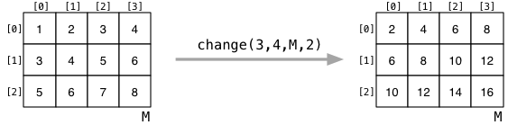

# Week 7 Tute

## 2D Arrays

flag[6][12]

flag2[72]

flag[i][j]

flag[i * 12 + j]

___
### 2. Give MIPS directives to represent the following variables:
### Assume that we are placing the variables in memory, at an appropriately aligned address, and with a label which is the same as the C variable name.

#### a) 
``` C
int v0;
```
.space 4


#### b)
``` C
int v1 = 42;
```
.word 42

#### c)
``` C
char v2;
```
.space 1

#### d)
``` C
char v3 = 'a';
```
.byte 'a'

#### e)
``` C
double v4;
```
.space 8

#### f)
``` c
int v5[20];
```
.space 80

#### g)
``` C
int v6[10][5];
```
.space 200

#### h)
``` C
struct { int x; int y; } v7;
```
.space 8

#### i)
``` C
struct { int x; int y; } v8[4];
```
.space 32

#### j)
``` C
struct { int x; int y; } *v9[4];
```
.space 16

___

### 3. Translate this C program to MIPS assembler.
``` C
int max(int a[], int length) {
    int first_element = a[0];
    if (length == 1) {
        return first_element;
    } else {
        // find max value in rest of array
        int max_so_far = max(&a[1], length - 1);
        if (first_element > max_so_far) {
            max_so_far = first_element;
        }
        return max_so_far;
    }
}
```

```
max:
    # prologue
    addi    $sp, $sp, -4
    sw  $ra, ($sp)
    addi	$sp, $sp, -4
    sw  $s0, ($sp)

    # alternate way of prologue
    # addi	$sp, $sp, -8
    # sw		$ra, 4($sp)
    # sw		$s0, 0($sp)

    # body
    lw		$s0, ($a0)          # int first_element = a[0];
                                # stored first_element in $s0
    

    bne $a1, 1, else1           # if (length != 1) goto else1;

    move 	$v0, $s0            # store first_element in $v0 for return
    j   end                     # goto end;

else1:
    addi	$a0, $a0, 4         # $a0 contains &a[1] (&a[0] + sizeof(int))
    addi	$a1, $a1, -1        # $a1 contains (length - 1)
    jal max                     # max(&a[1], length - 1);

    
    ble		$s0, $v0, end       # if (first_element <= max_so_far) goto end;
    
    move 	$v0, $s0            # max_so)far = first_element;

end:
    # epilogue
    lw		$s0, ($sp)
    addi	$sp, $sp, 4
    lw		$ra, ($ra)
    addi	$sp, $sp, 4

    # alternate way of epilogue
    # lw		$ra, 4($sp)
    # lw		$s0, 0($sp)
    # addi	$sp, $sp, 8
    
    jr		$ra
    


a:
    .word   1 2 3 4 5 6 7 8 9 10
```

___

### 4. Translate this C program to MIPS assembler.
``` C
#include <stdio.h>

char flag[6][12] = {
    {'#', '#', '#', '#', '#', '.', '.', '#', '#', '#', '#', '#'},
    {'#', '#', '#', '#', '#', '.', '.', '#', '#', '#', '#', '#'},
    {'.', '.', '.', '.', '.', '.', '.', '.', '.', '.', '.', '.'},
    {'.', '.', '.', '.', '.', '.', '.', '.', '.', '.', '.', '.'},
    {'#', '#', '#', '#', '#', '.', '.', '#', '#', '#', '#', '#'},
    {'#', '#', '#', '#', '#', '.', '.', '#', '#', '#', '#', '#'}
};

int main(void) {
    for (int row = 0; row < 6; row++) {
        for (int col = 0; col < 12; col++)
            printf ("%c", flag[row][col]);
        printf ("\n");
    }

}
```

MIPS:
```
    .text
main:
    # store row in $t0
    li		$t0, 0

loop1:
    bge		$t0, 6, end1
    
    # store col in $t1
    li		$t1, 0

loop2:
    bge		$t1, 12, end2
    
    li		$t2, 12
    mul     $t3, $t0, $t2       # row * 12
    add		$t3, $t3, $t1       # row * 12 + col (index of flag[row][col])
    
    lb		$a0, flag($t3)
    li		$v0, 11
    syscall                     # printf("%c", flag[row][col]);

    addi	$t1, $t1, 1

    b		loop2
    
end2:
    li		$a0, '\n'
    li		$v0, 11
    syscall

    addi	$t0, $t0, 1
    
    b   loop1

end1:
    li		$v0, 0
    jr		$ra
    

    .data
flag:
    .byte   '#', '#', '#', '#', '#', '.', '.', '#', '#', '#', '#', '#'
    .byte   '#', '#', '#', '#', '#', '.', '.', '#', '#', '#', '#', '#'
    .byte   '.', '.', '.', '.', '.', '.', '.', '.', '.', '.', '.', '.'
    .byte   '.', '.', '.', '.', '.', '.', '.', '.', '.', '.', '.', '.'
    .byte   '#', '#', '#', '#', '#', '.', '.', '#', '#', '#', '#', '#'
    .byte   '#', '#', '#', '#', '#', '.', '.', '#', '#', '#', '#', '#'
```

___
## MIPS Functions
$a0, $a1, $a2, $a3 - argument registers

$v0, $v1 - return registers

$s0 -> $s8 - save registers, saved between argument calls

$sp - stack pointer

Save onto the stack any of the save registers you use in your function, as well as $ra if you call another function!

___
### 5. Translate this C program to MIPS assembler using normal function calling conventions.
### `sum2` is a very simple function but don't rely on this when implementing `sum4`.
``` C
// sum 4 numbers using function calls

#include <stdio.h>

int sum4(int a, int b, int c, int d);
int sum2(int x, int y);

int main(void) {
    int z = sum4(11, 13, 17, 19);
    printf("%d\n", z);
    return 0;
}

int sum4(int a, int b, int c, int d) {
    int e = sum2(a, b);
    int f = sum2(c, d);
    return sum2(e, f);
}

int sum2(int x, int y) {
    return x + y;
}
```

MIPS:
```
    .text
# be careful when writing functions with prologue, body and epilogue to
# put name of the function above the prologue and to give the body a name that
# is not the name of the function!!
main:
main_prologue:
    addiu   $sp, $sp, -4
    sw		$ra, ($sp)

main_body:
    li		$a0, 11
    li		$a1, 13
    li		$a2, 17
    li		$a3, 19
    jal		sum4
    
    move 	$a0, $v0
    li		$v0, 1
    syscall                 # printf("%d", z);
    
    li      $v0, 11
    li		$a0, '\n'
    syscall                 # printf("\n");

main_epilogue:
    lw      $ra, ($sp)
    addiu   $sp, $sp, 4

    li		$v0, 0
    jr      $ra             # return 0;

# saving things from saved registers and ra onto the stack
sum4:
sum4_prologue:
    addiu   $sp, $sp, -4
    sw		$ra, ($sp)

    addiu   $sp, $sp, -4
    sw		$s0, ($sp)

    addiu   $sp, $sp, -4
    sw		$s1, ($sp)

    addiu   $sp, $sp, -4
    sw		$s2, ($sp)
    
sum4_body:
    move 	$s0, $a2        # save c into $s0
    move 	$s1, $a3        # save d into $s1

    # a and b are already in $a0 and $a1
    jal		sum2            # sum2(a, b)
    
    move    $s2, $v0        # save e into $s2

    move 	$a0, $s0        # load c into $a0
    move 	$a1, $s1        # load d into $a1
    jal		sum2            # sum2(c, d)
    
    move 	$a0, $s2        # load e into $a0
    move 	$a1, $v0        # load f into $a1
    jal     sum2            # sum2(e, f)

    # sum2(e, f) will be stored in $v0

# placing things from the stack back into the registers
sum4_epilogue:
    lw  $s2, ($sp)
    addiu   $sp, $sp, 4

    lw  $s1, ($sp)
    addiu   $sp, $sp, 4

    lw  $s0, ($sp)
    addiu   $sp, $sp, 4

    lw  $ra, ($sp)
    addiu   $sp, $sp, 4

    jr		$ra             # return sum2(e, f)
    
sum2:
    add		$v0, $a0, $a1
    jr		$ra					# return x + y
    
```

___
### 6. Consider the following operation that multiplies all of the elements in a matrix by a constant factor:



### This operation could be rendered in C99-standard C as
``` C
void change (int nrows, int ncols, int M[nrows][ncols], int factor)
{
    for (int row = 0; row < nrows; row++) {
        for (int col = 0; col < ncols; col++) {
            M[row][col] = factor * M[row][col];
        }
    }
}
```

```
change:
    li		$t0, 0              # int row = 0;
                                # store row in $t0

loop1:
    bge		$t0, $a0, end1      # if (row >= nrows) goto end1;

    li		$t1, 0              # int col = 0;
                                # store col in $t1

loop2:
    bge		$t1, $a1, end2      # if (col >= ncols) goto end2;

    # M[row][col] = M[row * ncols + col]
    mul     $t2, $t0, $a1       # store (row * ncols) in $t2
    add		$t2, $t2, $t1       # store (row * ncols + col) in $t2
    mul     $t2, $t2, 4         # calculate size of offset to access M[row][col]
    add		$t2, $t2, $a2       # calculate &M[row][col]

    lw		$t3, ($t2)          # store M[row][col] in $t3
    mul     $t3, $t3, $a3       # store (M[row][col] * factor) in $t3
    sw		$t3, ($t2)          # save (M[row][col] * factor) into &M[row][col]
    
    addi	$t1, $t1, 1         # col++;
    b		loop2               # goto loop2;

end2:
    addi	$t0, $t0, 1         # row++
    b       loop1               # goto loop1;

end1:
    jr		$ra
```


### Write a function in MIPS assembly equivalent to the above C code. Assume that the arguments are placed in the $a? registers in the order given in the function definition. e.g., the function could be called as follows in MIPS:
```
   li   $a0, 3
   li   $a1, 4
   la   $a2, M
   li   $a3, 2
   jal  change
```
### Where M is defined as:
```
    .data
M:  .word 1, 2, 3, 4
    .word 3, 4, 5, 6
    .word 5, 6, 7, 8
```

### 7. For each of the following struct definitions, what are the likely offset values for each field, and the total size of the struct:
### Both the offsets and sizes should be in units of number of bytes.

#### a)
``` C
struct _coord {
    double x;
    double y;
};
```
sizeof(struct _coord) = 16 and there is no padding


#### b)
``` C
typedef struct _node Node;
struct _node {
    int value;
    Node *next;
};
```
sizeof(Node) = 8 and there is no padding


#### c)
``` C
struct _enrolment {
    int stu_id;         // e.g. 5012345
    char course[9]:     // e.g. "COMP1521"
    char term[5];       // e.g. "17s2"
    char grade[3];      // e.g. "HD"
    double mark;        // e.g. 87.3
};
```

this should be stored at an address that is divisible by 8
| bytes | field |
|:---:|:---:|
| 0 - 3 | stu_id |
| 4 - 12 | course |
| 13 - 17 | term |
| 18 - 20 | grade |
| 21 - 23 | (padding so that mark will be aligned) |
| 24 - 31 | mark |

sizeof(struct _enrolment) = 32 and padding is 3


#### d)
``` C
struct _queue {
    int nitems;     // # items currently in queue
    int head;       // index of oldest item added
    int tail;       // index of most recent item added
    int maxitems;   // size of array
    Item *items;    // malloc'd array of Items
};
```

sizeof(struct _queue) = 20 and padding is 0
