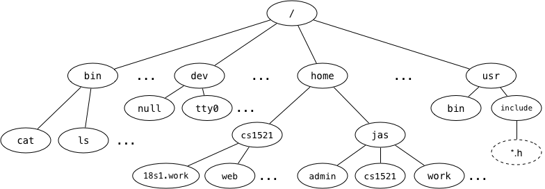

# Week 9 Tute

## Assignment 2
Reminder that [assignment 2](https://cgi.cse.unsw.edu.au/~cs1521/21T2/assignments/ass2/index.html) is out!


___
### 2. We say that the Unix filesystem is tree-structured, with the directory called / as the root of the tree, e.g.,



### Answer the following based on the above diagram:

### a) What is the full pathname of COMP1521's `web` directory?
/hoome/cs1521/web

### b) Which directory is `~jas/../..`?
/

### c) Links to the children of a given directory are stored as entries in the directory structure. Where is the link to the parent directory stored?
..

### d) What kind of filesystem object is `cat`?
Regular file

### e) What kind of filesystem object is `home`?
Directory

### f) What kind of filesystem object is `tty0`?
Special file (device)

### g) What kind of filesystem object is a symbolic link? What value does it contain?
Symbolic links are a special type of file that contain the name of another file

### h) Symbolic links change the filesystem from a tree structure to a graph structure. How do they do this?
Symbolic links can link arbitrary files in the filesystem together

___
### 3. The `stat()` and `lstat()` functions both take an argument which is a pointer to a struct stat object, and fill it with the meta-data for a named file.
### On Linux, a struct stat contains the following fields (among others, which have omitted for simplicity):
``` C
struct stat {
    ino_t st_ino;         /* inode number */
    mode_t st_mode;       /* protection */
    uid_t st_uid;         /* user ID of owner */
    gid_t st_gid;         /* group ID of owner */
    off_t st_size;        /* total size, in bytes */
    blksize_t st_blksize; /* blocksize for filesystem I/O */
    blkcnt_t st_blocks;   /* number of 512B blocks allocated */
    time_t st_atime;      /* time of last access */
    time_t st_mtime;      /* time of last modification */
    time_t st_ctime;      /* time of last status change */
};
```

### Explain what each of the fields represents (in more detail than given in the comment!) and give a typical value for a regular file which appears as follows:

```
ls -ls stat.c
8 -rw-r--r--  1 jas  cs1521  1855  Sep  9 14:24 stat.c
```

### Assume that `jas` has user id 516, and the `cs1521` group has group id 36820.

* `st_ino` is the inode number, which is an index into the filesystem's metadata
* `st_mode` contains information about the type of file and who can access the file and how
* `st_uid` contains the user ID of the owner of the file
* `st_gid` contains the group ID of the owner of the file
* `st_size` contains the size of the file in bytes, for text files, will be number of characters
* `st_blksize` contains the size of the blocks in the file
* `st_blocks` is the number of blocks of size 512B in the file, could be different from what is expected given the size of the file as blocks are often allocated in groups of 2^N
* `st_atime` is the time the file was last accessed (read from or written to)
* `st_mtime` is the time the file was last modified (written to)
* `st_ctime` is the time the file's status was last changed (changed contents of the file or its metadata)


___
### 4. Consider the following (edited) output from the command `ls -l ~cs1521`:
```
drwxr-x--- 11 cs1521 cs1521 4096 Aug 27 11:59 17s2.work
drwxr-xr-x  2 cs1521 cs1521 4096 Aug 20 13:20 bin
-rw-r-----  1 cs1521 cs1521   38 Jul 20 14:28 give.spec
drwxr-xr-x  3 cs1521 cs1521 4096 Aug 20 13:20 lib
drwxr-x--x  3 cs1521 cs1521 4096 Jul 20 10:58 public_html
drwxr-xr-x 12 cs1521 cs1521 4096 Aug 13 17:31 spim
drwxr-x---  2 cs1521 cs1521 4096 Sep  4 15:18 tmp
lrwxrwxrwx  1 cs1521 cs1521   11 Jul 16 18:33 web -> public_html
```
### a) Who can access the `17s2.work` directory?
The user `cs1521` has read, write and execute access to the directory and the group `cs1521` has read and execute access to the directory.

### b) What operations can a typical user perform on the `public_html` directory?
Assuming the typical user isn't in the `cs1521` group, they have execute access to `public_html`

### c) What is the file `web`?
It is a symbolic link to eht `public_html` directory

### d) What is the difference between `stat("web", &info)` and `lstat("web", &info)`?
### (where `info` is an object of type `(struct stat)`)
`stat` will follow symbolic links so `info` will contain information about `public_html` whereas `lstat` will not follow symbolic links so `info` will contain informaiton about the symbolic link `web` itself


___
### 5. Write a C program, `chmod_if_public_write.c`, which is given 1+ command-line arguments which are the pathnames of files or directories
### If the file or directory is publically-writeable, it should change it to be not publically-writeable, leaving other permissions unchanged.

### It also should print a line to stdout as in the example below
``` C
$ dcc chmod_if_public_write.c -o chmod_if_public_write
$ ls -ld file_modes.c file_modes file_sizes.c file_sizes
-rwxr-xrwx 1 z5555555 z5555555 116744 Nov  2 13:00 file_sizes
-rw-r--r-- 1 z5555555 z5555555    604 Nov  2 12:58 file_sizes.c
-rwxr-xr-x 1 z5555555 z5555555 222672 Nov  2 13:00 file_modes
-rw-r--rw- 1 z5555555 z5555555   2934 Nov  2 12:59 file_modes.c
$ ./file_modes file_modes file_modes.c file_sizes file_sizes.c
removing public write from file_sizes
file_sizes.c is not publically writable
file_modes is not publically writable
removing public write from file_modes.c
$ ls -ld file_modes.c file_modes file_sizes.c file_sizes
-rwxr-xr-x 1 z5555555 z5555555 116744 Nov  2 13:00 file_sizes
-rw-r--r-- 1 z5555555 z5555555    604 Nov  2 12:58 file_sizes.c
-rwxr-xr-x 1 z5555555 z5555555 222672 Nov  2 13:00 file_modes
-rw-r--r-- 1 z5555555 z5555555   2934 Nov  2 12:59 file_modes.c
```
### Make sure you handle errors.

``` C
#include <sys/types.h>
#include <sys/stat.h>
#include <unistd.h>
#include <stdio.h>

int main(int argc, char *argv[]) {
    if (argc < 2) {
        fprintf(stderr, "Wrong number of arguments\n");
    }

    for (int i = 1; i < argc; i++) {
        struct stat s;
        if (stat(argv[i], &s) != 0) {
            perror(argv[i]);
            return 1;
        }

        mode_t mode = s.st_mode;
        if (mode & S_IWOTH) {
            mode_t newmode = mode & ~S_IWOTH;
            if (chmod(argv[i], newmode) != 0) {
                perror(argv[i]);
                return 1;
            }

            print("removing public write from %s\n", argv[i]);
        } else {
            printf("%s is not publically writeable\n", argv[i]);
        }
    }

    return 0;
}
```

___
### 7. What does `fopen` do? What are its parameters?
`fopen` opens a file. It takes a filename and a string representing what mode to open it in.
Check out [`man fopen`](https://man7.org/linux/man-pages/man3/fopen.3.html) for more details about the modes

___
### 8. What are some circumstances when `fopen` returns NULL?
Check out [`man fopen`](https://man7.org/linux/man-pages/man3/fopen.3.html) and [`man 2 open`](https://man7.org/linux/man-pages/man2/open.2.html) for examples in the `ERRORS` section


___
### 9. How do you print the specific reason that caused `fopen` to return `NULL`?
Given an error number, `strerror` will return the corresponding string.

You can use `perror` to print a string to `stderr` with the string corresponding to the `errno` set.

___
### 10. Write a C program, `first_line.c`, which is given one command-line argument, the name of a file, and which prints the first line of that file to stdout. If given an incorrect number of arguments, or if there was an error opening the file, it should print a suitable error message.

``` C
#include <stdio.h>

int main(int argc, char *argv[]) {
    if (argc != 2) {
        fprintf(stderr, "Incorrect number of arguments\n");
        return 1;
    }

    FILE *stream = fopen(argv[1], "r");
    if (stream == NULL) {
        perror(argv[1]);
        return 1;
    }

    int c;
    while ((c = fgetc(stream)) != EOF) {
        fputc(c, stdout);
        if (c == '\n') {
            break;
        }
    }

    fclose(stream);
    return 0;
}
```

___
### 11. Write a C program, `write_line.c`, which is given one command-line argument, the name of a file, and which reads a line from `stdin`, and writes it to the specified file; if the file exists, it should be overwritten.

``` C
#include <stdio.h>

int main(int argc, char *argv[]) {
    if (argc != 2) {
        fprintf(stderr, "Incorrect number of arguments\n");
        return 1;
    }

    FILE *stream = fopen(argv[1], "w");
    if (stream == NULL) {
        perror(argv[1]);
        return 1;
    }

    int c;
    while ((c = getchar()) != EOF) {
        fputc(c, stream);
        if (c == '\n') {
            break;
        }
    }

    fclose(stream);
    return 0;
}

```

___
### 12. Write a C program, `append_line.c`, which is given one command-line argument, the name of a file, and which reads a line from `stdin` and appends it to the specified file.

Same as above but replace "w" in `fopen` with "a".

___
### 13. Why should you not use `fgets` or `fputs` with binary data?

`fgets` and `fputs` will read or write until it reaches a null terminator `'\0'`. Since null terminators are 0, and binary data often contains 0, you my often not read or write enough characters.

___
### 15. How many different values can `fgetc` return?
257 (0-255 as well as EOF)

___
### 16. Why are the names of `fgetc`, `fputc`, `getc`, `putc`, `putchar`, and `getchar` misleading?
Because they can be used for reading or writing bytes not just characters.

___
### 17. For each of the following calls to the fopen() library function, give an open() system call that has equivalent semantics relative to the state of the file.
### Obviously, fopen() returns a FILE*, and open() returns an integer file descriptor. Ignore this for the purposes of the question; focus on the state of the open file.

### a)
``` C
fopen(FilePath, "r")
```
"r" means we want to read and it should fail if the file does not exist, so
``` C
open(FilePath, O_RDONLY)
```

### b)
``` C
fopen(FilePath, "a")
```
"a" means we want to write to a file, if the file does not exist, we should create it, and if it does, we want to write to the end of it, so
``` C
open(FilePath, O_WRONLY | O_CREAT | O_APPEND)
```

### c)
``` C
fopen(FilePath, "w")
```
"w" means we want to write to a file, if the file does not exist, we should create it, and if it does, we want truncate it and write from the beginning, so
``` C
open(FilePath, O_WRONLY | O_CREAT | O_TRUNC)
```

### d)
``` C
fopen(FilePath, "r+")
```
"r+" means we want to read from and write to a file, if the file does not exist, it should fail, so
``` C
open(FilePath, O_RDWR)
```

### e)
``` C
fopen(FilePath, "w+")
```
"w+" means we want to read from and write to a file, if the file does not exist, we should create it, and if it does, we want to write to the end of it, so
``` C
open(FilePath, O_RWDR | O_CREAT | O_TRUNC)
```

___
### 18. Consider the `lseek(fd, offset, whence)` function.
### a) What is its purpose?
`lseek` moves the file position for an open file descriptor.

`whence` can be either `SEEK_SET` meaning the start of the file, `SEEK_CURR` meaning the current position of the file and `SEEK_END` meaning the end of the file.

`offset` is how far from `whence` the position should be moved.

### b) When would it be useful?
`lseek` is useful when you need to read from or write to a known position in the file

### c) What does its return value represent?
The return value will be -1 if it fails or the current position of the file

___
### 19. Consider a file of size 10000 bytes, open for reading on file descriptor fd, initially positioned at the start of the file (offset 0). What will be the file position after each of these calls to lseek()? Assume that they are executed in sequence, and one will change the file state that the next one deals with.
### a)
``` C
lseek(fd, 0, SEEK_END);
```
10000

### b)
``` C
lseek(fd, -1000, SEEK_CUR);
```
9000

### c)
``` C
lseek(fd, 0, SEEK_SET);
```
0

### d)
``` C
lseek(fd, -100, SEEK_SET);
```
return -1

position 0

### e)
``` C
lseek(fd, 1000, SEEK_SET);
```
1000


### f)
``` C
lseek(fd, 1000, SEEK_CUR);
```
2000


___
### 20. If a file `xyz` contains 2500 bytes, and it is scanned using the following code:
``` C
int fd;         // open file descriptor
int nb;         // # bytes read
int ns = 0;     // # spaces
char buf[BUFSIZ]; // input buffer

fd = open ("xyz", O_RDONLY);
assert (fd >= 0);
while ((nb = read (fd, buf, 1000)) > 0) {
    for (int i = 0; i < nb; i++)
        if (isspace (buf[i]))
            ns++;
}
close (fd);
```

### Assume that all of the relevant `#include`'s are done.
### How many calls with be made to the `read()` function, and what is the value of nb after each call?

| call number | nb | file position |
|:---:|:---:|:---:|
| 1 | 1000 | 1000 |
| 2 | 1000 | 2000 |
| 3 | 500 | 2500 |
| 4 | 0 | 2500 |